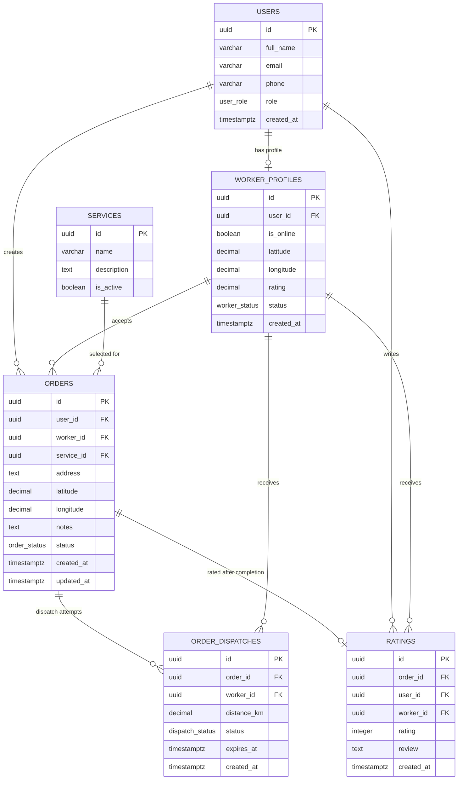
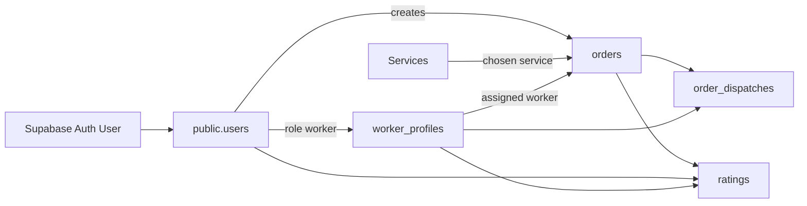

# Data Model, ERD, Supabase Schema, and RLS

## ERD

## Database Relationship Diagram

## Supabase Schema Design

See `supabase/schema.sql` for executable SQL. The schema uses:

- PostgreSQL enum types for roles and statuses.
- UUID primary keys.
- Foreign keys with cascade or set-null behavior.
- Indexes for role lookup, worker availability, order status, and dispatch queues.
- Realtime publication for `orders`, `worker_profiles`, and `order_dispatches`.

## Key Tables

- `users`: application profile and role.
- `worker_profiles`: worker availability, operational status, rating, location.
- `services`: service catalog.
- `orders`: core order lifecycle.
- `order_dispatches`: one record per worker notification attempt.
- `ratings`: post-completion feedback.

## RLS Strategy

### Users

- Users can read and update their own profile.
- Admin can read and update all users.
- Users can insert only their own profile after auth signup.

### Worker Profiles

- Authenticated users can read active worker metadata needed for dispatch and dashboards.
- Workers can update their own online status/location.
- Admin can activate, deactivate, or suspend any worker.

### Services

- Authenticated users can read active services.
- Admin can create, update, or deactivate services.

### Orders

- Users can create orders for themselves.
- Users can read their own orders.
- Workers can read waiting orders and their assigned orders.
- Admin can read all orders.
- Workers assigned to an order can update operational status.

### Dispatches

- Workers can read dispatches addressed to their worker profile.
- Admin/service role creates dispatch rows.
- Dispatch status changes should be constrained to eligible workers/admin.

### Ratings

- Users can rate their completed orders.
- Participants and admin can read ratings.
- One rating per order.

## Security Recommendations

- Use service role only in server-only code or Supabase Edge Functions.
- Never expose service role key to the browser.
- Keep worker location precision limited in user-facing UI until accepted.
- Validate every status transition in server actions or database functions.
- Add audit logs for admin actions in a future release.
