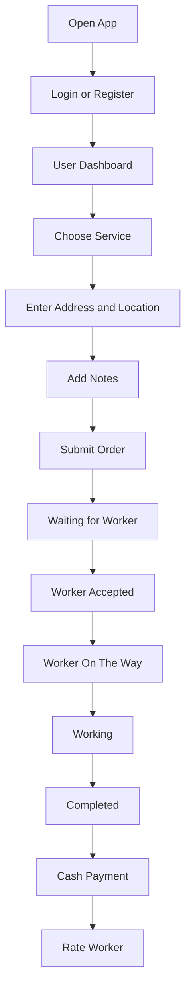
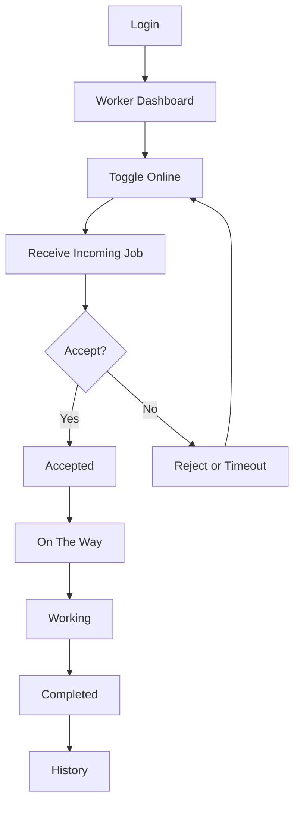
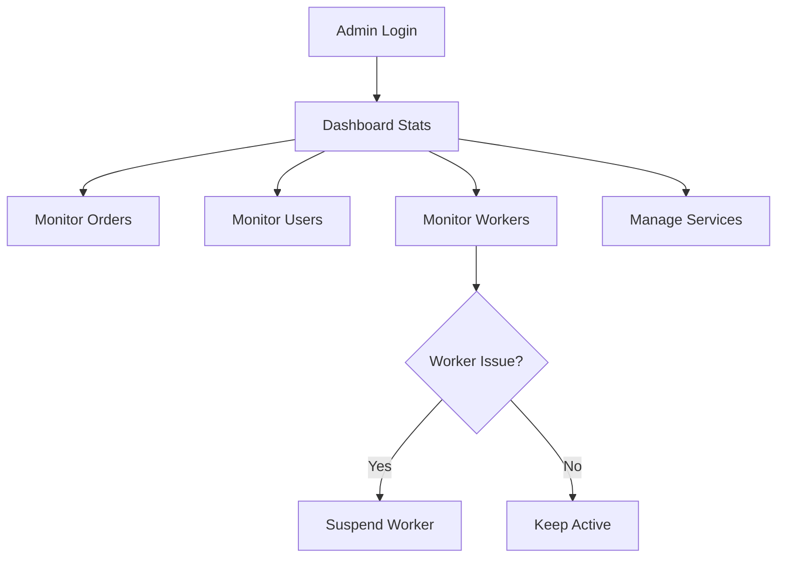
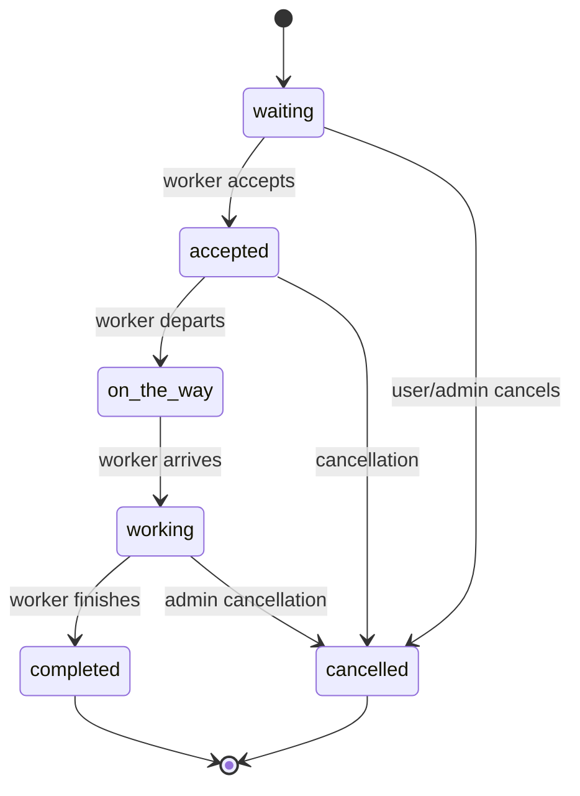

# Flow Diagrams and Order Lifecycle

## User Flow Diagram

## Worker Flow Diagram

## Admin Flow Diagram

## Order Lifecycle Diagram

## Status Rules

- `waiting`: created, no worker assigned yet.
- `accepted`: worker has accepted the job.
- `on_the_way`: worker is traveling to customer.
- `working`: work is in progress.
- `completed`: work is finished and ready for rating/payment.
- `cancelled`: order ended before completion.

## UX Flow Constraints

- User order creation should require no more than 4 steps.
- Worker acceptance must be a single primary button.
- Status labels must be human-readable, not raw enum names.
- Every status transition should show immediate visual feedback.
