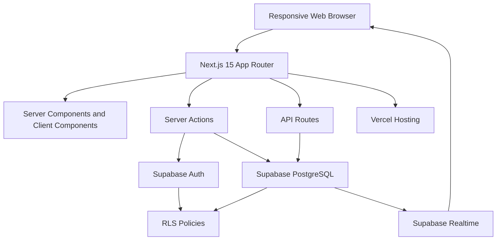
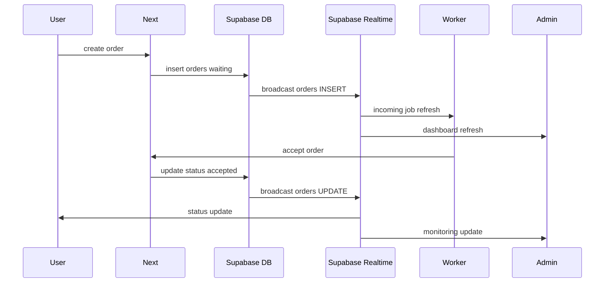

# Architecture, API, State, Realtime, and Notifications

## System Architecture Diagram



## API Specification

### Auth Server Actions

`signUp(formData)`

- Input: full_name, email, phone, role, password.
- Output: redirects to dashboard or register error.
- Side effects: creates Supabase Auth user, inserts `users`, creates `worker_profiles` for worker.

`signIn(formData)`

- Input: email, password.
- Output: session cookie and redirect.

`signOut()`

- Output: clears session and redirects to login.

### Order Server Actions

`createOrder(formData)`

- Input: service_id, address, latitude, longitude, notes.
- Output: creates order and redirects to order detail.
- Side effects: calls dispatch API.

`acceptOrder(orderId)`

- Input: order ID.
- Output: assigns worker and sets status to accepted.

`updateOrderStatus(orderId, status)`

- Input: order ID and next status.
- Output: updates order status.

`rateOrder(formData)`

- Input: order_id, user_id, worker_id, rating, review.
- Output: creates rating.

### Worker Server Actions

`toggleWorkerOnline(isOnline)`

- Input: boolean.
- Output: updates worker online state.

`setWorkerStatus(workerId, status)`

- Input: worker ID and active/inactive/suspended.
- Output: admin updates worker availability.

### Services Server Actions

`createService(formData)`

- Input: name, description, is_active.
- Output: creates service.

`toggleService(serviceId, isActive)`

- Input: service ID and boolean.
- Output: updates service availability.

### REST API

`POST /api/matching/dispatch`

Request:

```json
{
  "orderId": "uuid"
}
```

Response:

```json
{
  "candidates": [
    {
      "worker_id": "uuid",
      "distance_km": 1.2,
      "expires_at": "2026-06-04T10:00:00.000Z"
    }
  ]
}
```

Behavior:

- Load order location.
- Load active online workers.
- Calculate Haversine distance.
- Sort nearest first.
- Create first pending dispatch.
- Future production scheduler expires dispatch after 60 seconds and moves to next worker.

## Folder Structure

```text
app/
  (auth)/
  admin/
  api/
  dashboard/
  history/
  orders/
  profile/
  worker/
components/
  ui/
  app-shell.tsx
  order-card.tsx
  worker-card.tsx
  status-badge.tsx
lib/
  actions/
  data/
  supabase/
  constants.ts
  types.ts
  utils.ts
supabase/
  schema.sql
  seed.sql
docs/
  product-planning/
  ui-ux/
```

## State Management Strategy

- Prefer server components for initial data loading.
- Use server actions for mutations.
- Use Supabase Realtime client subscriptions for live updates.
- Keep local component state only for UI state: forms, loading, selected tabs, optimistic feedback.
- Avoid global state for MVP unless cross-page client state becomes necessary.
- Use URL routes as durable state for order detail and dashboards.

## Realtime Event Architecture



## Notification Architecture

### MVP

- In-app realtime notification through Supabase Realtime.
- Worker incoming jobs appear in `/worker/jobs`.
- User order detail refreshes on status changes.
- Admin dashboards update from order/worker events.

### Future

- Push notifications with web push.
- WhatsApp/SMS fallback for worker dispatch.
- Notification table for durable notification history.
- Retry queue for failed notification delivery.
- Scheduled function to expire dispatch after 60 seconds.

## Notification Event Types

- `order.created`
- `dispatch.created`
- `dispatch.expired`
- `order.accepted`
- `order.status_changed`
- `worker.suspended`
- `rating.created`
